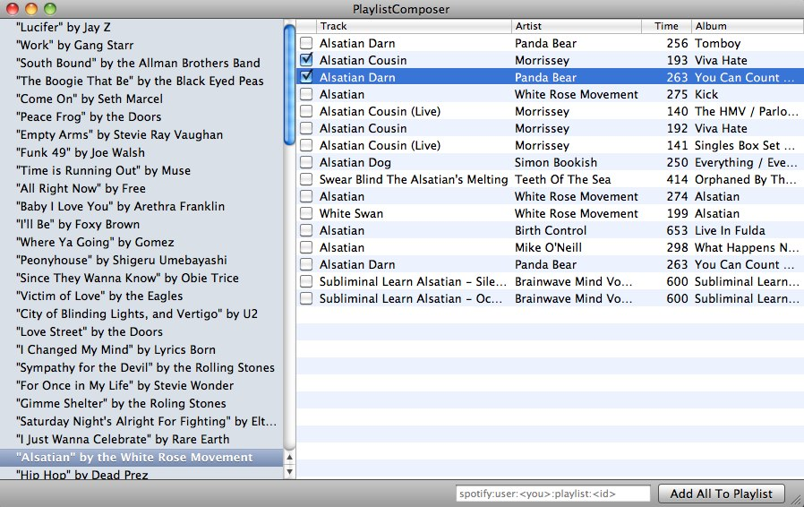

Intro With Background
==========

I like the tv-show Entourage. I found a list of all tracks played on all
8 seasons of the show. I thought it would be neat to create a playlist of all 
the songs in Spotify instead of manually finding and downloading mp3s through 
illegal means. And you know what, I'm a developer. I should be able to 
solve this with my haxxor skills. This is the result of my research and coding.

What I wanted to do:

1. play around with MacRuby
2. compose a Spotify-playlist of all tracks played on all seasons of the tv-show Entourage
3. play around with ways to interact with Spotify and their APIs
4. Learn more about Cocoa APIs

The Result
======

The app looks like this:

You open a *.txt-file containing a list of songs, one per row. See example in `Song List (input)`.
The app searches Spotify for each song and gives a result-list for each song. Then you check the songs
that should be added to your Spotify-playlist and finally press "Add All To Playlist".

My Own Technical Notes
=====================

Example use of spotify-api-server:

    curl -X POST 'http://localhost:1337/playlist/spotify:user:johan_lunds:playlist:1lRfoo2nell6Wj0zt7fc9K/add?index=3' -H "Content-Type: application/json" -d '["spotify:track:5Aubxc1radpVFuAu7eEUMy"]' -i

Build Jansson:

    ./configure --prefix=/Users/johan_lunds/Documents/Kod/Ruby/add_to_spotify_playlist/spotify-api-server/jansson-2.1/installed/

Build spotify-api-server:

Read README.txt and follow instructions. Also:

    diff --git a/Makefile b/Makefile
    index b8f6ac8..029f033 100644
    --- a/Makefile
    +++ b/Makefile
    @@ -5,7 +5,7 @@ SOURCES=appkey.c account.c diff.c json.c server.c
     all: $(SOURCES) server
     
     server:
    - $(CC) $(CFLAGS) `apr-1-config --includes --ldflags --link-ld --cflags --cppflags` -I/usr/include/subversion-1 -lspotify -lsvn_diff-1 -lsvn_subr-1 -ljansson -levent -levent_pthreads $(SOURCES) -o $@
    + $(CC) $(CFLAGS) `apr-1-config --includes --ldflags --link-ld --cflags --cppflags` -I/usr/include/subversion-1 -I/Users/johan_lunds/Documents/Kod/Ruby/add_to_spotify_playlist/spotify-api-server/jansson-2.1/installed/include -L/Users/johan_lunds/Documents/Kod/Ruby/add_to_spotify_playlist/spotify-api-server/jansson-2.1/installed/lib -framework libspotify -lsvn_diff-1 -lsvn_subr-1 -ljansson -levent -levent_pthreads $(SOURCES) -o $@
     
     clean:
      rm -f *.o server
    diff --git a/account.c b/account.c
    index 1c820c9..91cb562 100644
    --- a/account.c
    +++ b/account.c
    @@ -1,2 +1,2 @@
    -const char username[] = "username";
    -const char password[] = "password";
    +const char username[] = "FOO";
    +const char password[] = "BAR";

3rd Party Resources Used
========================

* spotify-api-server, mirror: https://github.com/liesen/spotify-api-server
* libspotify docs and examples